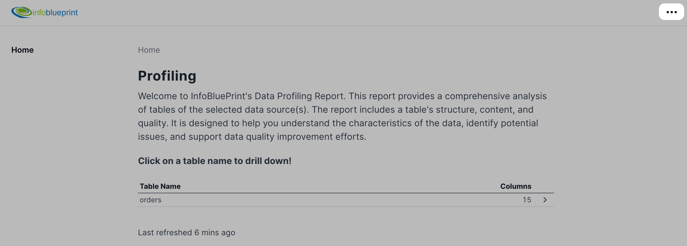
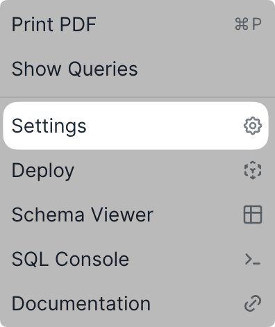
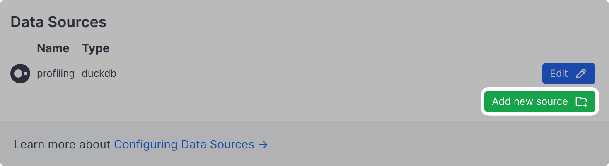

# System Requirements
The InfoBlueprint data profiling tool requires python, git, Node.js 18 or 20, and NPM 7 or above.

## Automatic install
The easiest way to install the required dependencies is to use the provided `setup.sh` script. This script will install the required dependencies and start the application.

#### On Mac/Linux systems:
```bash
./setup.sh
```

#### On Windows PowerShell: 
```bash
.\setup.sh
```

#### On Windows CMD: 
```bash
bash setup.sh # requires Git Bash or similar
```

If you would rather install the dependencies manually, you can follow the instructions below.

## Manual install
Check your versions with `python --version`, `node -v` and `npm -v`

**Note:** if you are installing NodeJS for the first time, be sure to install the Long term suppport (LTS) version. 

> [Download Node.js + NPM (LTS version)](https://nodejs.org/en/download)

If you are installing python for the first time you can install it here.

[Download Python](https://www.python.org/downloads/)

### Updating
Update to the latest npm version with npm install -g npm@latest

### Git
Evidence requires git. If you do not already have git installed, you can follow the [instructions here](https://git-scm.com/book/en/v2/Getting-Started-Installing-Git).

We also recommend signing up for [GitHub](https://github.com/)

# Profiling instructions
## Connnecting to a Data Source
If you followed the automatic install the application should be running on [http://localhost:3000](http://localhost:3000) and would have opened in your default browser. If you are running the application manually, you can run `invoke init`.

1. Click the `•••` icon in the top right corner of the screen.

    


2. Click `Settings` or use the [Settings URL](http://localhost:3000/settings/).

    

3. Click `Add new source`

    

4. Choose the datasource type and give it a name.
5. Fill in the required fields and click `Test Connection`.
6. If the connection is successful, click `Confirm Changes`.

## Load tables
In the repo there is a folder called **sources** and you should see a subfolder with the name of the datasource you just created.
To profile the tables you need to add a sql file for each table you would like to profile. For example if you have a table called `customers` in the `main` schema you would add a file called `customers.sql` to the datasource folder, with the file containing `select * from main.customers` (You do not need to add a `;` at the end of the query). You can check if the tables have been loaded by clicking the `•••` icon in the top right corner of the screen and clicking `Schema Viewer` or using the [Schema URL](http://localhost:3000/explore/schema/).

## Profiling
To profile the tables you have loaded you can run the following command in the terminal:
```bash
invoke profile
```

Once the profiling is complete you can refresh the home page and the tables should be visible!

**Note:** If you want to delete the demo `orders` table, you can run 
```bash
invoke del -n orders # any table can be deleted this way
```
